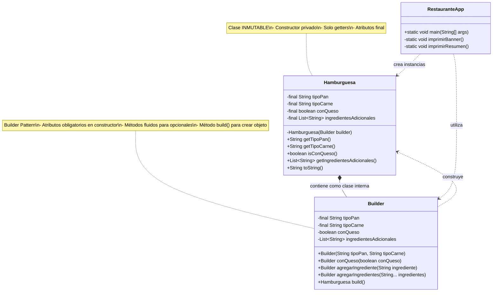

# 🍔 PATRÓN BUILDER - SISTEMA DE HAMBURGUESAS

**Estudiante:** Javier Rodríguez Rincón
**Código:** 20231020172  
**Universidad:** Universidad Distrital Francisco José de Caldas  
**Materia:** Ingeniería de Software

---

## 📋 Descripción del Proyecto

Implementación del **Patrón de Diseño Builder** para resolver el problema de creación de objetos complejos con múltiples configuraciones. Este proyecto desarrolla un módulo para un sistema de pedidos de comida rápida donde las hamburguesas pueden personalizarse de diversas maneras según las preferencias del cliente.

## 🎯 Objetivo

Demostrar la correcta aplicación del patrón Builder para:
- ✅ Evitar constructores con múltiples parámetros
- ✅ Diferenciar atributos obligatorios y opcionales
- ✅ Garantizar objetos consistentes e inmutables
- ✅ Mejorar la legibilidad y mantenibilidad del código

## 🏗️ Diagrama UML - Patrón Builder



## 📊 Estructura del Patrón Builder

### Componentes del Patrón

1. **Producto (Hamburguesa)**
   - Clase inmutable con atributos `final`
   - Constructor privado
   - Solo getters, sin setters
   - Contiene el Builder como clase interna estática

2. **Builder (Hamburguesa.Builder)**
   - Clase interna estática
   - Constructor con atributos obligatorios
   - Métodos encadenables (fluent interface)
   - Método `build()` que construye el producto

3. **Cliente (RestauranteApp)**
   - Utiliza el Builder para crear hamburguesas
   - No accede directamente al constructor de Hamburguesa

## 🔑 Características Implementadas

### Atributos Obligatorios
- **Tipo de Pan**: String (Integral, Blanco, Ajonjolí, Sin Gluten, etc.)
- **Tipo de Carne**: String (Res, Pollo, Cerdo, Vegetariana, Pavo, etc.)

### Atributos Opcionales
- **Queso**: boolean (default: false)
- **Ingredientes Adicionales**: List<String> (Lechuga, Tomate, Cebolla, etc.)

### Reglas de Diseño Cumplidas

| Regla | Estado | Implementación |
|-------|--------|----------------|
| Clase Hamburguesa inmutable | ✅ | Atributos `final`, sin setters |
| Constructor privado | ✅ | `private Hamburguesa(Builder builder)` |
| Creación mediante Builder | ✅ | `new Hamburguesa.Builder()` |
| Atributos obligatorios en constructor | ✅ | `Builder(String pan, String carne)` |
| Atributos opcionales por métodos | ✅ | `conQueso()`, `agregarIngrediente()` |
| Método build() | ✅ | `build()` crea instancia inmutable |

## 📁 Estructura del Proyecto

```
hamburguesa-builder/
│
├── Hamburguesa.java          # Clase producto (inmutable)
│   └── Builder (clase interna)
│
├── RestauranteApp.java       # Aplicación principal con main
│
├── ANALISIS.md               # Análisis detallado del problema
│
└── README.md                 # Este archivo
```

## 🚀 Compilación y Ejecución

### Requisitos Previos
- Java JDK 8 o superior instalado
- Variable de entorno JAVA_HOME configurada

### Compilar el Proyecto

```bash
javac *.java
```

### Ejecutar la Aplicación

```bash
java RestauranteApp
```

## 💡 Ejemplos de Uso

### Ejemplo 1: Hamburguesa Clásica

```java
Hamburguesa clasica = new Hamburguesa.Builder("Blanco", "Res")
    .conQueso(true)
    .agregarIngrediente("Lechuga")
    .agregarIngrediente("Tomate")
    .agregarIngrediente("Cebolla")
    .agregarIngrediente("Pepinillos")
    .build();
```

**Salida:**
```
╔════════════════════════════════════════╗
║         HAMBURGUESA PERSONALIZADA       ║
╚════════════════════════════════════════╝
🍞 Pan: Blanco
🥩 Carne: Res
🧀 Queso: Sí
🥬 Ingredientes adicionales:
   • Lechuga
   • Tomate
   • Cebolla
   • Pepinillos
════════════════════════════════════════
```

### Ejemplo 2: Hamburguesa Vegetariana

```java
Hamburguesa vegetariana = new Hamburguesa.Builder("Integral", "Vegetariana")
    .conQueso(false)
    .agregarIngredientes("Lechuga", "Tomate", "Aguacate", "Espinaca")
    .build();
```

**Salida:**
```
╔════════════════════════════════════════╗
║         HAMBURGUESA PERSONALIZADA       ║
╚════════════════════════════════════════╝
🍞 Pan: Integral
🥩 Carne: Vegetariana
🧀 Queso: No
🥬 Ingredientes adicionales:
   • Lechuga
   • Tomate
   • Aguacate
   • Espinaca
════════════════════════════════════════
```

### Ejemplo 3: Hamburguesa Simple

```java
Hamburguesa simple = new Hamburguesa.Builder("Ajonjolí", "Pollo")
    .build();
```

**Salida:**
```
╔════════════════════════════════════════╗
║         HAMBURGUESA PERSONALIZADA       ║
╚════════════════════════════════════════╝
🍞 Pan: Ajonjolí
🥩 Carne: Pollo
🧀 Queso: No
🥬 Ingredientes adicionales: Ninguno
════════════════════════════════════════
```

## ✅ Cumplimiento de Actividades

### Actividad 1: Análisis del Problema ✅
- **Entregable**: Documento `ANALISIS.md` con análisis detallado
- **Contenido**: Comprensión del problema, identificación de atributos, justificación del patrón

### Actividad 2: Diseño del Builder ✅
- **Entregable**: Diagrama UML en Mermaid incluido en este README
- **Contenido**: Estructura completa del patrón con relaciones y notas explicativas

### Actividad 3: Implementar Hamburguesa ✅
- **Entregable**: Archivo `Hamburguesa.java`
- **Características**: Inmutable, constructor privado, sin lógica de construcción directa

### Actividad 4: Implementar Builder ✅
- **Entregable**: Clase `Builder` dentro de `Hamburguesa.java`
- **Características**: Constructor con obligatorios, métodos encadenables, método `build()`

### Actividad 5: Crear Hamburguesas ✅
- **Entregable**: Implementación en `RestauranteApp.java`
- **Contenido**: 5 hamburguesas distintas creadas usando el Builder

### Actividad 6: Mostrar por Consola ✅
- **Entregable**: Método `toString()` en Hamburguesa y salida en `RestauranteApp`
- **Contenido**: Información completa de cada hamburguesa con formato visual

## 🎨 Salida del Programa

Al ejecutar `RestauranteApp`, se muestran:

1. ✅ Banner de bienvenida con información del estudiante
2. ✅ 5 hamburguesas diferentes:
   - Hamburguesa Clásica (con queso y 4 ingredientes)
   - Hamburguesa Vegetariana Premium (sin queso, 5 ingredientes)
   - Hamburguesa Simple (solo pan y carne)
   - Hamburguesa De Lujo (con queso, 7 ingredientes)
   - Hamburguesa Fit (sin queso, 3 ingredientes)
3. ✅ Demostración de validación de datos
4. ✅ Resumen de ventajas del patrón

## 💪 Ventajas del Patrón Builder

### Comparación con Alternativas

| Característica | Constructor | Setters | Builder |
|----------------|-------------|---------|---------|
| Legibilidad | ❌ Baja | ⚠️ Media | ✅ Alta |
| Inmutabilidad | ⚠️ Parcial | ❌ No | ✅ Completa |
| Escalabilidad | ❌ Baja | ⚠️ Media | ✅ Alta |
| Validación | ⚠️ Limitada | ❌ Difícil | ✅ Centralizada |
| Thread-Safety | ✅ Sí | ❌ No | ✅ Sí |
| Mantenibilidad | ❌ Baja | ⚠️ Media | ✅ Alta |

### Beneficios Específicos

✅ **Código Auto-documentado**: Los nombres de métodos explican qué hace cada configuración  
✅ **Sin Confusión de Parámetros**: No hay que recordar el orden de los parámetros  
✅ **Objetos Consistentes**: Solo se crean objetos válidos y completos  
✅ **Fácil Extensión**: Agregar nuevos ingredientes no afecta código existente  
✅ **Fluent Interface**: Encadenamiento de métodos para código más legible  
✅ **Validación Robusta**: Errores detectados tempranamente con mensajes claros  

## 🔒 Características de Seguridad

### Inmutabilidad Garantizada

```java
// Todos los atributos son final
private final String tipoPan;
private final String tipoCarne;
private final boolean conQueso;
private final List<String> ingredientesAdicionales; // Lista inmutable
```

### Validación de Datos

```java
// Validación en constructor del Builder
if (tipoPan == null || tipoPan.trim().isEmpty()) {
    throw new IllegalArgumentException("El tipo de pan es obligatorio");
}
```

### Thread-Safety

- Los objetos Hamburguesa son inmutables → thread-safe por diseño
- No hay estado compartido mutable
- Seguro para uso en entornos concurrentes

## 📚 Conceptos del Patrón Builder

### Definición

El patrón Builder es un patrón de diseño creacional que permite construir objetos complejos paso a paso. Separa la construcción de un objeto complejo de su representación, permitiendo que el mismo proceso de construcción pueda crear diferentes representaciones.

### Cuándo Usar Builder

- Cuando un objeto tiene muchos parámetros opcionales
- Cuando se necesita crear objetos inmutables
- Cuando el proceso de construcción es complejo
- Cuando se requiere validación antes de crear el objeto
- Cuando diferentes representaciones del mismo objeto son necesarias

### Ventajas del Patrón

1. **Construcción paso a paso** de objetos complejos
2. **Reutilización del código** de construcción
3. **Aislamiento del código complejo** de construcción
4. **Objetos inmutables** con validación

## 🎓 Principios SOLID Aplicados

### Single Responsibility Principle (SRP)
- `Hamburguesa`: Solo representa el objeto
- `Builder`: Solo se encarga de la construcción

### Open/Closed Principle (OCP)
- Abierto para extensión (agregar ingredientes)
- Cerrado para modificación (no cambiar la estructura)

### Dependency Inversion Principle (DIP)
- El cliente depende de la abstracción (Builder)
- No depende de detalles de construcción

## 📖 Referencias

- **Head First Design Patterns** - Freeman & Freeman
- **Effective Java (3rd Edition)** - Joshua Bloch
- **Design Patterns: Elements of Reusable Object-Oriented Software** - Gang of Four
- **Clean Code** - Robert C. Martin

## 👨‍💻 Autor

**Javi**  
Código: 20231020172  
Estudiante de Ingeniería de Sistemas  
Universidad Distrital Francisco José de Caldas

---

## 📄 Licencia

Este proyecto es de uso académico para la materia de Ingeniería de Software.

---

## 🚀 Próximos Pasos

Posibles extensiones del proyecto:

1. Agregar más tipos de productos (bebidas, postres)
2. Implementar persistencia de pedidos
3. Crear interfaz gráfica
4. Agregar sistema de precios
5. Implementar patrón Factory para crear diferentes tipos de comidas

---

**Última actualización:** 2024  
**Versión:** 1.0.0
